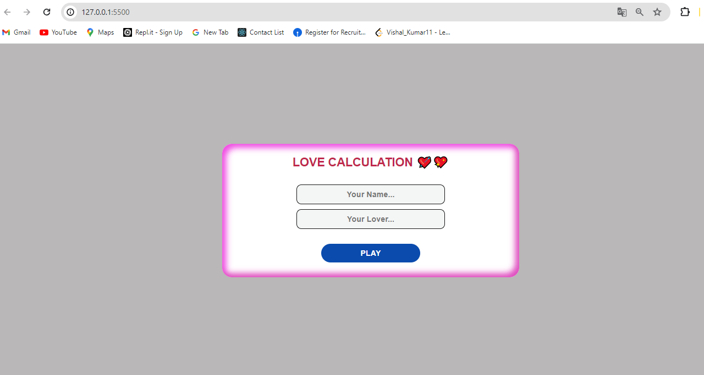
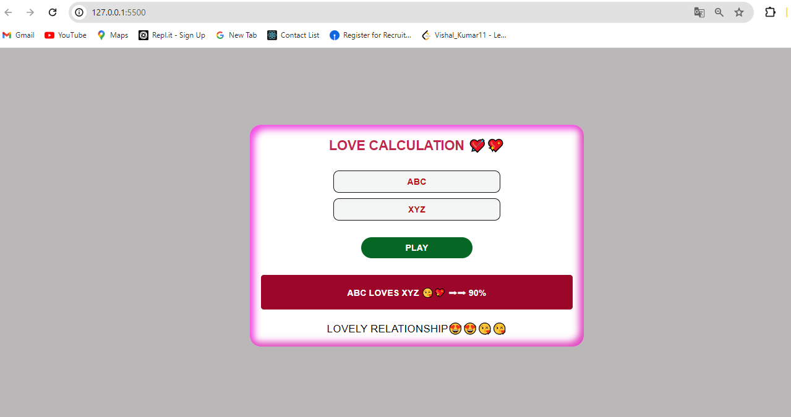

# Love Calculation Application

This project is a simple web application that allows users to calculate the percentage of love compatibility between two names. The project consists of HTML, CSS, and JavaScript files.

### Click the Go Live button and see the live👉 [Go Live](https://12vishalkumar.github.io/Love-Calculation-Application)

## File Structure

- `index.html`: The main HTML file that contains the structure of the web page.
- `style.css`: The CSS file that styles the web page.
- `script.js`: The JavaScript file that contains the logic for the love calculation.

## Description of Files

### index.html

The HTML file defines the structure of the web page. It includes:
- The `<!DOCTYPE html>` declaration and the opening `<html>` tag with a language attribute set to "en".
- The `<head>` section which contains metadata, including the character set, viewport settings, the title of the page, and a link to the external CSS file.
- The `<body>` section which contains the main content of the page:
  - A container div with a nested content div.
  - A heading for the application.
  - An input area with two text inputs for the names.
  - A button that triggers the love calculation.
  - Two paragraphs for displaying the result and the relationship statement.
- A script tag that links to the external JavaScript file.

### script.js

The JavaScript file contains the logic for the love calculation function:
- The `love()` function is triggered when the "Play" button is clicked.
- It retrieves the values of the two input fields.
- It checks if both names have at least 3 characters; if not, it alerts the user.
- It generates a random percentage between 0 and 100.
- It updates the result paragraph to display the names and the love percentage.
- It updates the statement paragraph based on the percentage:
  - If the percentage is 60 or below, it displays "Moderate Relationship".
  - If the percentage is above 60, it displays "Lovely Relationship".
- Both paragraphs are made visible after the calculation.

### style.css

The CSS file styles the web page:
- General styles are applied to reset margins, padding, and box-sizing for all elements.
- The `body` is styled with a background color, a font family, and centered content.
- The `.container` class styles the main container with a box shadow, border radius, background color, and centered text.
- The `.content` class ensures the content fills the container.
- The `h1` tag within `.content` is styled with uppercase text, specific color, font, and margins.
- The `.inputarea` class styles the input section with centered, stacked inputs.
- The `input` elements are styled with width, height, padding, borders, and background color.
- The button is styled with width, padding, background color, text transformation, and a hover effect.
- The `#print` and `#statement` paragraphs are styled with background color, padding, text transformation, font styles, and hidden by default.
- Media queries adjust styles for screens smaller than 768px.

## Usage

To use the application:
1. Open `index.html` in a web browser.
2. Enter your name and your lover's name in the respective input fields.
3. Click the "Play" button to see the love compatibility percentage and relationship statement.

## Dependencies

- The application uses Google Fonts for the 'Poppins' font family.
- No additional libraries or frameworks are required.

## Notes

- The love calculation is random and purely for fun; it does not reflect any real compatibility metrics.
- Ensure that both names are at least 3 characters long for the calculation to work.

## Installation

No installation is required for this project. Simply download or clone the repository, and open the `index.html` file in a web browser to use the application.

## How It Works

1. **Input Names**: The user inputs two names into the provided text fields.
2. **Calculate Love Percentage**: When the "Play" button is clicked, the JavaScript function `love()` is executed.
   - **Validation**: The function checks if both names have at least 3 characters. If not, an alert is shown.
   - **Random Calculation**: If the validation passes, a random percentage between 0 and 100 is generated.
   - **Display Result**: The result paragraph is updated to show the love percentage and a relationship statement based on the percentage.
3. **Result Display**: The result and the statement are displayed on the page.

## Contributing

Contributions are welcome! If you have suggestions or improvements, please fork the repository and submit a pull request.

1. Fork the Project
2. Create your Feature Branch (`git checkout -b feature/AmazingFeature`)
3. Commit your Changes (`git commit -m 'Add some AmazingFeature'`)
4. Push to the Branch (`git push origin feature/AmazingFeature`)
5. Open a Pull Request

## License

This project is open source and available under the [MIT License](LICENSE).

## Contact

If you have any questions or feedback, feel free to reach out.

- **Name**: Your Name
- **Email**: your.email@example.com
- **GitHub**: [Your GitHub Profile](https://github.com/yourusername)

## Output Screen
   - #### Before Love Calculation
   

   - #### After Love Calculation
   
